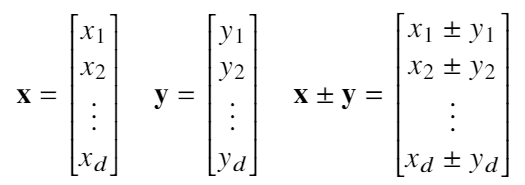
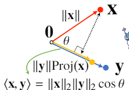
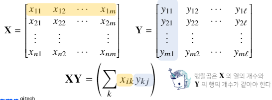
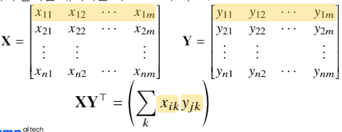
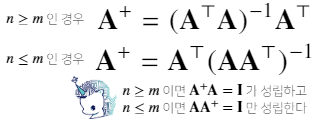
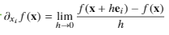
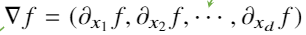
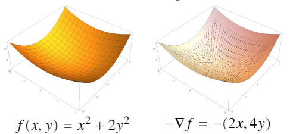
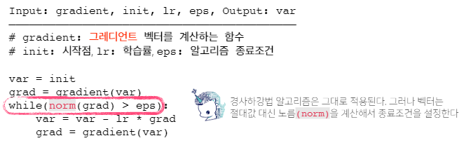
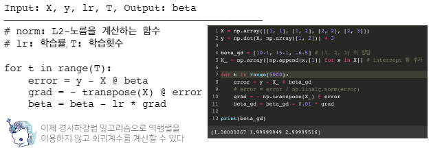

# AI Math 정리

**내용 정리**

### **벡터**

- **벡터**
    - 벡터는공간에서 한점을 나타냄
    - 벡터는 원점으로부터 상대적 위치를 표현
    - 벡터에 숫자를 곱해주면 길이만 변함
- **행(가로) 벡터, 열(세로) 벡터 →** 일반적으로 행벡터 형태로 사용
- **벡터의 갯수는 차원이라 함**
- **벡터끼리 같은 모양을 가지면 덧셈,뺄셈, 성분곱을 계산할 수 있음**
    
    
    
- **벡터의 노름(norm)**
    
    원점에서부터의 거리를 말함
    
    - **L1-노름** : 각성분의 변화량의 절대값을 모두 더함
    - **L2-노름** : 피타고라스 정리를 이용해 유클리드 거리를 계산
- **두 벡터사이의 거리**
    
    $||x-y|| = ||y-x||$ 를 이용
    
- **두 벡터사이의 각도 (L2에서 가능)**
    
    $||x-y||_2 = ||y-x||_2$ 를 이용
    
    $cos(theta) = (||x||_2^2 + ||y||_2^2 - ||x-y||_2^2) / (2||x||_2||y||_2)$ 
    
    ⇒ $cos(theta)=<x,y> / ||x||_2||y||_2$
    
- **내적**
    - **정사영(orthogonalprojection)된 벡터의 길이**
        
        
        

### 행렬

- **행렬**
    - 벡터를 원소로 가지는 2차원 배열
    - 행렬은 행(row)과 열(column)이라는 인덱스(index)를 가짐
- **행렬끼리 같은모양을 가지면 덧셈,뺄셈을 계산**
    - 성분곱은 벡터와 똑같다
- **행렬곱셈(matrixmultiplication)**
    - **i번째 행벡터**와 **j번째 열벡터** 사이의 내적을 성분으로 가지는 행렬을 계산
        
        
        
    - **Numpy에서는 @연산을 사용**
- **행렬 내적**
    - 넘파이의 np.inner는 **i번째 행벡터**와 **j번째 행벡터** 사이의 내적을 성분으로 가지는 행렬을계산
        
        
        
- **특성**
    - 행렬곱을 통해 벡터를 다른 차원의 공간으로 보냄
    - 행렬곱을 통해 패턴을 추출할 수 있고 데이터를 압축
- **역행렬 $AA^{-1}=A^{-1}A=I$**
    - 어떤 행렬의 연산을 거꾸로 되돌리는 행렬
    - 행과 열 숫자가 같고 행렬식(determinant)이 0이 아닌 경우에만 계산
        - **Numpy에서는 np.linalg.inv(x)연산을 사용**
    - 만일 역행렬을 계산할 수 없다면 유사 역행렬(pseudo-inverse) 또는 무어-펜로즈(Moore-Penrose)역행렬을 이용
        - **Numpy에서는 np.linalg.pinv(x)연산을 사용**
        - 행렬 길이에 따른 수식 변화
            
            
            
- 응용
    - **연립방정식 풀기**
    - **선형회귀분석**

### **경사하강법**

- **미분(differentiation)**
    
    변수의 움직임에 따른 함수 값의 변화를 측정하기 위한 도구로 최적화에서 제일 많이 사용하는 기법
    
    ```python
    import sympy as sym
    from sympy.abc import x
    sympy.diff(sym.poly(x**2+2*x+3),x)
    ```
    
- 미분은 함수의 주어진 점에서의 **접선의 기울기**를 구한다
    
    한점에서 접선의 기울기를 알면 어느방향으로 점을 움직여야 함수 값이 증가하는지/감소하는지 알 수 있다
    
    **미분값을 더하면 경사상승법**(gradientascent)이라하며 함수의 **극대값의 위치**를 구할 때 사용한다
    
    **미분값을 빼면 경사하강법**(gradientdescent)이라하며 함수의 **극소값의 위치**를 구할 때 사용한다
    
- **변수가 벡터(움직이는 방향이 여러개)**
    
    벡터가 입력이 다변수 함수의 경우 **편미분(partialdifferentiation)을** 사용
    
    
    
    각 변수별로 편미분을 계산한 **그레디언트(gradient)벡터**를 이용하여 경사하강/경사상승법에 사용
    
    
    
    
    
- **알고리즘**
    
    
    

### **경사하강법2**

- 선형회귀분석 복습
    
    np.linalg.pinv를 이용하면 데이터를 선형모델(linearmodel)로 해석하는 선형회귀식을 찾을 수 있다  
    

**경사하강법 기반 선형회귀 알고리즘**



- 이론적으로 경사하강법은 미분가능하고 볼록(convex)한 함수에 대해선 적절한 학습률과 학습 횟수를 선택했을때 수렴이 보장
- 하지만 비선형회귀문제의 경우 목적식이 볼록하지 않을 수 있으므로 수렴이 항상 보장되지는 않습니다
- **확률적 경사하강법**
    - 확률적 경사하강법(stochasticgradientdescent)은 모든 데이터를 사용해서 업데이트하는 대신 데이터 한개 또는 일부 활용하여 업데이트 한다
    - 볼록이 아닌(non-convex) 목적식은 SGD를 통해 최적화 할 수 있다
    - **SGD는 미니배치(전체 데이터가 아닌 일부 데이터)를 가지고 그레디언트 벡터를 계산** 미니배치는 확률적으로 선택하므로 목적식 모양이 바뀌게 됨
    - SGD는 볼록이 아닌 목적식에서도 사용 가능하므로 경사하강법보다 머신러닝 학습에 더 효율적

### 통계학

- **모수**
    - 통계적 모델링은 적절한 가정 위에서 확률분포를 추정(inference)하는 것이 목표이며, 기계학습과 통계학이 공통적으로 추구하는 목표
    - 데이터가 특정 확률 분포를 따른다고 선형적으로 가정한 후 그 분포를 결정하는 모수(parameter)를 추정하는 방법을 모수적(parametric)방법론 이라합니다
    - 특정 확률분포를 가정하지 않고 데이터에 따라 모델의 구조 및 모수의 개수가 유연하게 바뀌면 비모수(nonparametric)방법론 이라부릅니다
- 최대가능도 추정법
    - 가장 가능성이 높은 모수를 추정하는 방법
    - 정규분포
    - 카테고리분포
- 딥러닝에서 최대가능도 추정법
    - 소프트맥스 벡터의 로그가능도를 최적화
    - 분류 문제에서 정답 레이블을 P, 모델예측을 Q라 두면 최대가능도 추정법은 쿨백-라이블러 발산을 최소화하는 것과 같습니다

### **베이즈 통계학**

- 베이즈 정리는 조건부확률을 이용하여 정보를 갱신하는 방법