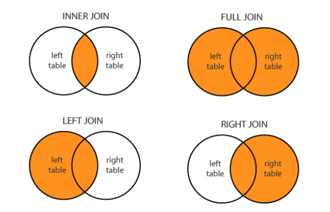

# 파이썬

### **Pythonic code**

- **Split & Join**
    
    ```python
    #Split
    items = 'zero one two three'.split()
    print(items)
    """
    ['zero','one','two','three']
    """
    
    example = 'teamlab.technology.io'
    subdomain,domain,tld = example.split('.')
    
    #--------------------------------------------------------
    #Join
    colors = ['red','blue','green','yellow']
    result =''.join(colors)
    result
    """
    'redbluegreenyellow'
    """
    
    result ='-'.join(colors) #connect by "-"
    result
    """
    'red-blue-green-yellow'
    """
    ```
    
- **List comprehension**
    
    ```python
    #기존 방식
    result =[]
    for i in range(10):
    	result.append(i)
    
    #--------------------------------------------------------
    #리스트 comprehension (more fast)
    result = [i for i in range(10)]
    
    word_1 ="Hello"
    word_2 ="World"
    result = [i + j for i in word_1 for j in word_2]
    
    #add filter 
    result = [i+j for i in case_1 for j incase_2 if not(i==j)] 
    #select value by if 
    [i + j if not(i==j) else i for i in case_1 for j in case_2]
    
    result = [[i+j for i in case_1] for j in case_2] #j case_2 first 
    result
    """
    [['AD', 'BD', 'CD'], ['AE', 'BE', 'CE'], ['AA', 'BA', 'CA']]
    """
    ```
    
- **Enumerate & zip**
    
    **enumerate** : list의 element를 추출할 때 번호를 붙여서 추출
    
    **zip** : 두개의 list의 값을 병렬적으로 추출함
    
    ```python
    #enumerate
    for i,v in enumerate(['tic','tac','toe']):
    	print(i,v)
    """
    0 tic
    1 tac
    2 toe
    """
    #--------------------------------------------------------
    #zip
    alist= ['a1','a2','a3']
    blist= ['b1','b2','b3']
    for a,b in zip(alist,blist): # 병렬적 값 추출
    	print(a,b)
    """
    a1 b1
    a2 b2
    a3 b3
    """
    
    [sum(x) for x in zip((1,2,3), (10,20,30), (100,200,300))]
    """
    [111,222,333]
    """
    
    #--------------------------------------------------------
    #enumerate & zip
    for i, (a,b) in enumerate(zip(alist,blist)):
    	print(i,a,b) # index alist[index] blist[index]
    """
    0 a1 b1
    1 a2 b2
    2 a3 b3
    """
    ```
    
- **Lambda & map & reduce**
    
    **Lambda** : Python 3부터는 권장하지 않음 **여전히 많이 쓰임**
    
    - 테스트 어려움
    - 코드 해석의 어려움
    - 이름이 존재하지 않는 함수의 출현
    - 협업에서의 어려움
    
    **reduce :** map function과 달리 list에 똑같은 함수를 적용해서 통합
    
    Legacy library나 다양한 머신러닝코드에서 여전히 사용 중
    
    ```python
    #Lambda 
    def f(x, y):
    	return x + y
    
    f = lambda x, y: x + y
    print((lambda x: x+1)(5))
    
    #--------------------------------------------------------
    #map zip처럼 사용 but, comprehension으로 사용할 수 있음
    ex= [1,2,3,4,5]
    f = lambda x, y: x+y
    print(list(map(f, ex, ex)))
    """
    [2, 4, 6, 8, 10]
    """
    
    #--------------------------------------------------------
    #reduce
    from functools import reduce
    print(reduce(lambdax, y: x+y, [1, 2, 3, 4, 5]))
    """
    1+2 = 3+3 = 6+4 = 10+5 = **15 출력**
    """
    ```
    
- **Iterable object**
    
    내부적 구현으로 __iter__ 와 __next__ 가 사용됨
    
    iter() 와 next() 함수로 iterable객체를 iterator object로 사용
    
    ```python
    cities = ["Seoul", "Busan", "Jeju"]
    iter_obj = iter(cities)
    print(next(iter_obj))
    print(next(iter_obj))
    print(next(iter_obj))
    next(iter_obj)
    ```
    
- **Generator***
    
    iterable object를 특수한 형태로 사용해주는 함수
    
    element가 사용되는 시점에 값을 메모리에 반환
    
    yield를 사용해 한번에 하나의 element만 반환함
    
    ```python
    def general_list(value):
    	result = []
    	for i in range(value):
    		result.append(i)
    	return result
    
    def geneartor_list(value):
    	result = []
    	for i in range(value):
    		yield i
    #결과는 같지만 큰 데이터를 다룰 때 메모리 절약을 할 수 있음
    
    gen_ex= (n*n for n in range(500)) #"(...)"로 표현
    print(type(gen_ex))
    ```
    
- **Function passing argument**
    
    함수에 입력되는 parameter의 변수명을 사용, arguments를 넘김
    
    ```python
    #Keyword arguments
    def print_somthing(my_name,your_name):
    	print("Hello {0}, My name is {1}".format(your_name,my_name))
    
    print_somthing("Sungchul","TEAMLAB")
    print_somthing(your_name="TEAMLAB",my_name="Sungchul")
    
    #--------------------------------------------------------
    #Default arguments
    def print_somthing_2(my_name,your_name="TEAMLAB"):
    	print("Hello {0}, My name is {1}".format(your_name,my_name))
    print_somthing_2("Sungchul","TEAMLAB")
    print_somthing_2("Sungchul")
    ```
    
- **Variable-length asterisk***
    
    **Variable-length**
    
    개수가 정해지지 않은 변수를 함수의parameter로 사용하는 법
    
    Asterisk(*) 기호를 사용하여 함수의 parameter를 표시함
    
    **Keyword variable-length**
    
    Parameter 이름을 따로 지정하지 않고 입력하는 방법
    
    asterisk(*) 두개를 사용하여 함수의parameter를 표시함
    
    입력된 값은 dicttype으로 사용할 수 있음
    
    **Asterisk(*)** 
    
    unpacking의 역할 list의 값들이 하나의 값들로 들어가짐
    
    ```python
    #variable-length
    def asterisk_test(a,b, *args):
    	return a+b+sum(args)
    print(asterisk_test(1,2,3,4,5))
    """
    15
    """
    #--------------------------------------------------------
    #Keyword variable-length
    def kwargs_test_1(**kwargs):
    	print(kwargs)
    
    def kwargs_test_2(**kwargs):
    	print(kwargs)
    	print("First value is {first}".format(**kwargs))
    	print("Second value is {second}".format(**kwargs))
    	print("Third value is {third}".format(**kwargs))
    
    #--------------------------------------------------------
    #가변인자 순서(키워드 아닌것 들이 먼저!)
    def kwargs_test_3(one, two, *args, **kwargs):
    	print(one+two+sum(args))
    	print(kwargs)
    
    kwargs_test_3(3,4,5,6,7,8,9,first=3,second=4,third=5)
    
    #--------------------------------------------------------
    #Asterisk
    a, b, c = ([1, 2], [3, 4], [5, 6])
    print(a, b, c) 
    
    data = ([1, 2], [3, 4], [5, 6])
    print(*data)
    #--------------------------------------------------------
    #dict에서는 **로 쓰게 됨
    def asterisk_test(a, b, c, d,):
    	print(a, b, c, d)
    data= {"b":1, "c":2, "d":3}
    
    asterisk_test(10, **data)
    #--------------------------------------------------------
    for data in zip(*([1, 2], [3, 4], [5, 6])):
    	print(data)
    """
    [1, 3, 5]
    [2, 4, 6]
    """
    ```
    

### **Python Object Oriented Programming**

- **Class**
    
    Attribute 추가는 __init___ , self와 함께
    
    __init__은 객체 초기화 예약 함수
    
    __는 특수한 예약 함수나 변수 그리고 함수명 변경(맨글링)으로 사용
    
    예) main , add , str , eq 
    
    [파이썬 더블 언더스코어: Magic Method | Corikachu](https://corikachu.github.io/articles/python/python-magic-method)
    
    ```python
    class SoccerPlayer(object):
    	def __init__(self, name, position, back_number):
    		self.name = nameself.position = position
    		self.back_number = back_number
    
    	def change_back_number(self, new_number):
    		print("선수의 등번호를 변경합니다: From %d to %d" % (self.back_number, new_number))
    		self.back_number = new_number
    
    jinhyun = SoccerPlayer("Jinhyun", "MF", 10)
    
    jinhyun = SoccerPlayer("Jinhyun", "MF", 10)
    print("현재 선수의 등번호는:", jinhyun.back_number)
    jinhyun.change_back_number(5)
    print("현재 선수의 등번호는:", jinhyun.back_number)
    ```
    
- **OOP Implementation Example**
    
    ```python
    class Note(object):
    	def __init__(self, content = None):
    		self.content = content
    	def write_content(self, content):
    		self.content = content
    	def remove_all(self):
    		self.content = ""
    	def __add__(self, other):
    		return self.content + other.content
    	def __str__(self):
    		return self.content
    
    #--------------------------------------------
    class NoteBook(object):
    	def __init__(self, title):
    		self.title = title
    		self.page_number = 1self.notes = {}
    
    	def add_note(self, note, page = 0):
    		if self.page_number < 300:
    			if page == 0:
    				self.notes[self.page_number] = note
    				self.page_number += 1
    			else:
    				self.notes = {page : note}
    				self.page_number += 1
    		else:
    			print("Page가모두채워졌습니다.")
    
    	def remove_note(self, page_number):
    		if page_numberinself.notes.keys():
    			return self.notes.pop(page_number)
    		else:
    			print("해당페이지는존재하지않습니다")
    
    	def get_number_of_pages(self):
    		return len(self.notes.keys())
    ```
    
- **OOP characteristics**
    - **Inheritance 상속**
        - 부모 클래스로 부터 속성과 Method를 물려 받은 자식클래스를 생성하는 것
        
        ```python
        **class Person(object):
        	def __init__(self,  name, age):
        		self.name = name
        		self.age = age
        
        class Korean(Person): #(Person)을 상속
        	pass
        
        first_korean = Korean("Sungchul",  35 )
        print(first_korean.name)**
        
        #----------------------------------------------
        **class Person(object): # 부모 클래스Person 선언
        	def __init__(self, name, age, gender):
        		self.name = name
        		self.age = age
        		self.gender = gender
        	def about_me(self): # Method 선언
        		print("저의이름은", self.name, "이구요, 제나이는", str(self.age), "살입니다.")
        
        class Employee(Person):  # 부모 클래스Person으로 부터 상속
        	def __init__(self,  name, age, gender, salary, hire_date):
        		super().__init__(name,  age, gender) # 부모객체 사용
        		self.salary = salary
        		self.hire_date = hire_date #속성값 추가
        
        	def do_work(self): # 새로운 메서드추가
        		print("열심히일을합니다.")
        
        	def about_me(self): # 부모 클래스함수 재정의
        		super().about_me()  # 부모 클래스 함수사용
        		print("제급여는",  self.salary, "원이구요, 제입사일은",  self.hire_date, " 입니다.")**
        ```
        
    - **Polymorphism 다형성**
        - 같은 이름 메소드의 내부로직을 다르게 작성
        - Dynamic Typing 특성으로 인해 파이썬에서는 같은 부모 클래스의 상속에서 주로 발생함
        - 중요한OOP의 개념 그러나 너무 깊이 알 필요X
    - **Visibility 가시성**
        - 객체의 정보를 볼 수 있는 레벨을 조절하는것
        - 누구나 객체안에 모든 변수를 볼 필요가 없음
            - 객체를 사용하는 사용자가 임의로 정보수정
            - 필요없는 정보에는 접근할 필요가 없음
            - 소스의 보호
        
        ```python
        class Inventory(object):
        	def __init__(self):
        		self.__items= [] #__를 추가
        	def add_new_item(self, product):
        		if type(product) == Product:
        			self.__items.append(product)
        			print("new item added")
        		else:
        			raiseValueError("Invalid Item")
        	def get_number_of_items(self):
        		return len(self.__items)
        
        class Inventory(object):
        	def __init__(self):
        		self.__items = []
        
        	@property #변수처럼 사용하게 해줌
        	def items(self):
        		return self.__items #바로 리턴하지 않고 복사해서 리턴한는게 일반적
        
        my_inventory = Inventory()
        my_inventory.add_new_item(Product())
        my_inventory.add_new_item(Product())
        print(my_inventory.get_number_of_items())
        
        items = my_inventory.items
        items.append(Product())
        print(my_inventory.get_number_of_items()) 
        ```
        
- **Decorate**
    - **First-class objects**
        - 일등함수 또는 일급객체
        - 변수나 데이터 구조에 할당이 가능한 객체
        - 파라메터로 전달이 가능 + 리턴 값으로 사용
        
        ```python
        def square(x):
        	return x * x
        f = square
        f(5)
        ```
        
    - **Inner function**
        - 함수 내에 또 다른 함수가 존재
            
            ```python
            def print_msg(msg):
            	def printer():
            		print(msg)
            	printer()
            
            print_msg("Hello, Python")
            ```
            
        - **closures** : inner function을 return값 으로 반환
            
            ```python
            def print_msg(msg):
            	def printer():
            		print(msg)
            	return printer
            
            another = print_msg("Hello, Python")
            another()
            
            def tag_func(tag, text):
            	text = text
            	tag = tag  
            	def inner_func():
            		return'<{0}>{1}<{0}>'.format(tag, text) 
            	return inner_func
            
            h1_func = tag_func('title', "This is Python Class") 
            p_func = tag_func('p', "Data Academy")
            ```
            
        - **decorator function** : 복잡한 클로져 함수를 간단하게
            
            ```python
            def star(func):
            	def inner(*args, **kwargs):
            		print("*"* 30)
            		func(*args, **kwargs)
            		print("*"* 30)
            return inner
            
            def percent(func):
            	def inner(*args, **kwargs):
            		print("%"*  30 )
            		func(*args, **kwargs)
            		print("%"*  30 )
            	return inner
            
            @star
            @percent
            def printer(msg):
            	print(msg)
            
            printer("Hello")
            
            #---------------------------------------
            def generate_power(exponent):
            	def wrapper(f):
            		def inner(*args):
            			result = f(*args)
            			return exponent**result
            		return inner
            	return wrapper
            
            @generate_power(2)
            def raise_two(n):
            	return n**2
            
            print(raise_two(7))
            
            ```
            

### **Module and Project**

- **Module**
    
    ```python
    #fah_converter.py
    def covert_c_to_f(celcius_value):
    	return celcius_value* 9.0 / 5 + 32
    
    #module_ex.py
    import fah_converter
    
    print("Entera celsius value: "),
    celsius= float(input())
    fahrenheit = fah_converter.covert_c_to_f(celsius)
    print("That's", fahrenheit, " degrees Fahrenheit")
    ```
    
- **Namespace**
    - 모듈을 호출할 때 범위 정하는 방법
    - 모듈안에는 함수와 클래스 등이 존재 가능
    - 필요한 내용만 골라서 호출할 수 있음
    - from과 import 키워드를 사용함
    
    ```python
    #Alias 설정하기–모듈명을 별칭으로
    import fah_converter as fah #fah_converter를 fah라는 이름으로 
    print(fah.covert_c_to_f(41.6)) #그 안에 covert_c_to_f 함수를 쓴다
    
    #모듈에서 특정함수 또는 클래스만 호출하기
    from fah_converter import covert_c_to_f
    print(covert_c_to_f(41.6)) #covert_c_to_f함수만호출함
    
    #모듈에서 모든함수 또는 클래스를 호출하기
    from fah_converter import *
    print(covert_c_to_f(41.6)) #전체호출
    ```
    
- **Package**
    - 하나의 대형프로젝트를 만드는 코드의 묶음
    - 다양한 모듈들의 합, 폴더로 연결됨
    - init , main 등 키워드 파일명이 사용됨
    - 다양한 오픈소스들이 모두 패키지로 관리됨
        
        
        
    - 폴더별로__init__.py 구성하기
        - 현재폴더가 패키지임을 알리는 초기화 스크립트
        - 없을경우 패키지로 간주하지않음 (3.3+ 부터는X)
        - 하위폴더와 py파일(모듈)을 모두 포함함
        - **import와 __all__ keyword 사용**
    - **__main__.py**
        
        ```python
        #__main__.py 파일만들기
        from stage.main import game_start
        from stage.sub import set_stage_level
        from image.character import show_character
        from sound.bgm import bgm_play
        
        if __name__ == '__main__':
        	game_start()
        	set_stage_level(5)
        	bgm_play(10)
        	show_character()
        ```
        
    - **상대 참조로 호출하는 방법**
        
        ```python
        from game.graphic.render importrender_test() #절대 참조
        from .renderimportrender_test() # .현재디렉토리기준
        from ..sound.echoimportecho_test(). # ..부모디렉토리기준
        ```
        
- **Virtual Environment**
    - conda
        
        ```python
        #생성
        conda create -n my_project python=3.8
        
        #호출
        conda activate my_project
        
        #패키지 설치
        conda install <패키지명>
        conda install matplotlib
        ```
        

### **File / Exception / Log Handling**

- **Exception Handling**
    - 구현
        
        ```python
        try:
        	#예외 발생 가능 코드
        except<Exception Type>:
        	#예외 발생시 대응하는 코드
        
        try:
        	#예외 발생 가능 코드
        except<Exception Type>:
        	#예외 발생시 대응하는 코드
        else:
        	#예외가 발생하지 않을 때 동작하는 코드
        
        try:
        	#예외 발생 가능 코드
        except<Exception Type>:
        	#예외 발생시 대응하는 코드
        finally:
        	#예외 발생 여부와 상관없이 실행됨
        ```
        
    - **Built-in Exception: 기본적으로 제공하는 예외**
        
        
        | IndexError | List의Index 범위를넘어갈 때 |
        | --- | --- |
        | NameError | 존재하지 않은 변수를 호출할 때 |
        | ZeroDivisionError | 0으로숫자를나눌때 |
        | ValueError | 변환할 수 없는 문자/숫자를 변환할 때 |
        | FileNotFoundError | 존재하지 않는 파일을 호출할 때 |
    - **raise 구문**
        
        필요에 따라 강제로 Exception을 발생
        
        ```python
        raise <Exception Type>(예외정보)
        ```
        
    - **assert 구문**
        
        특정 조건에 만족하지 않을 경우 예외 발생
        
        ```python
        assert 예외조건
        assert isinstance(decimal_number, int)
        ```
        
- **File Handling**
    - Binary파일
        - 컴퓨터만 이해할 수 있는 형태인
        - 이진(법)형식으로 저장된 파일
        - 일반적으로 메모장으로 열면내용이 깨져 보임(메모장 해설 불가)
        - 엑셀파일, 워드파일등등
    - Text파일
        - 인간도 이해할 수 있는 형태인 문자열형식으로 저장된 파일
        - 메모장으로 열면 내용 확인 가능
        - 메모장에 저장된 파일 HTML 파일, 파이썬 코드 파일 등
    - Python File I/O
        - **Open module**
            
            ```python
            f = open("<파일이름>","접근 모드", encoding="utf8")
            # r 읽기모드 / w 쓰기모드 / a 추가모드
            f.close()
            ```
            
            ```python
            f = open("i_have_a_dream.txt", "r")
            contents = f.read()
            print(contents)
            f.close()
            
            #with를 함께 쓰면 close를 할 필요 없음
            with open ("i_have_a_dream.txt", "r") as my_file:
            	contents= my_file.read()
            	print(type(contents), contents)
            
            #한 줄씩 읽기
            my_file.readline()
            #한번에 읽기 list형식
            my_file.readlines()
            ```
            
        - **OS module**
            
            ```python
            #os 모듈을 사용하여 Directory 다루기
            import os
            os.mkdir("log")
            
            #디렉토리가 있는지 확인하기
            if not os.path.isdir("log"):
            	os.mkdir("log")
            
            #최근에는 pathlib모듈을 사용하여 path를 객체로 다룸
            import pathlib
            ```
            
        - **Pickle**
            - 파이썬의 객체를 영속화(persistence)하는 built-in 객체
            - 데이터, object 등 실행 중 정보를 저장 → 불러와서 사용
            - 저장해야하는 정보, 계산결과(모델) 등 활용이 많음
            
            ```python
            import pickle
            #저장
            f = open("list.pickle","wb ")
            test = [1,2,3,4,5]
            pickle.dump(test,f)
            f.close()
            
            #불러오기
            f = open("list.pickle","rb ")
            test_pickle = pickle.load(f)
            print(test_pickle)
            f.close()
            ```
            
- **Logging Handling**
    - 프로그램 진행 상황에 따라 다른 Level의 Log를 출력함
    - 개발시점, 운영 시점마다 다른 Log가 남을 수 있도록 지원함
    - DEBUG > INFO > WARNING > ERROR > Critical
    - Log 관리 시 가장 기본이 되는 설정 정보
    
    ```python
    import logging #Python의 기본 Log 관리 모듈
    
    logging.debug("틀렸잖아!")
    logging.info("확인해")
    logging.warning("조심해!")
    logging.error("에러났어!!!")
    logging.critical("망했다...")
    
    #Level 변경
    logger = logging.getLogger("main")
    logging.basicConfig(level=logging.DEBUG)
    logger.setLevel(logging.INFO)
    
    #파일로 저장
    stream_hander = logging.StreamHandler("name.log", mode = "w", encoding="utf8")
    logger.addHandler(stream_hander)
    
    formatter = logging.Formatter('%(  asctime)s %(levelname)s %(process)d %(message)s')
    ```
    

---

- **configparser**
    - 프로그램의 실행 설정을 file에 저장함
    - Section, Key, Value 값의 형태로 설정된 설정 파일을 사용
    - 설정 파일을 DictType으로 호출 후 사용
    
    ```python
    [SectionOne]
    Status: Single
    Name: DerekValue:  
    YesAge: 30
    Single:  True
    
    [SectionTwo]
    FavoriteColor = Green
    
    [SectionThree]
    FamilyName: Johnson
    
    import configparser
    config = configparser.ConfigParser()
    config.sections()
    
    config.read('example.cfg')
    config.sections()
    
    for key in config['SectionOne']:
    	print(key)
    
    config['SectionOne']["status"]
    ```
    
- **argparser**
    - Console 창에서 프로그램 실행 시 Setting 정보를 저장함
    - 거의 모든 Console 기반 Python 프로그램 기본으로 제공
    - 특수 모듈도 많이존재하지만(TF), 일반적으로 argparse를사용
    - Command-Line Option 이라고 부름
    
    ```python
    import argparse
    parser = argparse.ArgumentParser(description='Sum two integers.')
    
    parser.add_argument('-a', "--a_value", dest="A_value", help="A integers", type=int)
    parser.add_argument('-b', "--b_value", dest="B_value", help="B integers", type=int)
    
    args= parser.parse_args()
    print(args)
    print(args.a)
    print(args.b)
    print(args.a+ args.b)
    ```
    

### **Python data handling**

- **Comma Separate Value (CSV)**
    - CSV, 필드를 쉼표(,)로 구분한 텍스트 파일
    - 엑셀 양식의 데이터를 프로그램에 상관없이 쓰기 위한 데이터 형식
    - 탭(TSV), 빈칸(SSV)등으로 구분해서 만들기도함
    - 통칭하여character-separated values (CSV) 부름
    - 엑셀에서는 “다름 이름 저장” 기능으로 사용 가능
    
    ```python
    #파일로 읽기 잘 사용 X
    line_counter = 0    #파일의 총 줄수를세는 변수
    data_header= []   #data의 필드값을저장하는list
    customer_list= [] #cutomer개별List를 저장하는List
    with open("customers.csv") ascustomer_data: #customer.csv 파일을customer_data객체에   저장
    	while True:
    		data = customer_data.readline() #customer.csv에 한줄씩data변수에 저장
    		if not data: break #데이터가없을 때, Loop종료
    		if line_counter==0: #첫번째 데이터는 데이터의필드
    			data_header = data.split(",")  #데이터의 필드는data_header List에저장, 데이터 저장시“,”로 분리
    		else:
    			customer_list.append(data.split(",")) #일반 데이터는customer_list객체에  저장, 데이터 저장시“,”로 분리
    	line_counter += 1
    
    print("Header:\t ", data_header) #데이터 필드 값 출력
    for i in range(0,10): #데이터 출력(샘플10개만)
    	print("Data",i,":\t\t",customer_list[i])
    print(len  (customer_list)) #전체 데이터 크기출력
    
    #--------------------------------------------------------------
    #모듈을 이용 
    #quotechar:문자열을 둘러싸는 신호 문자
    import csv 
    reader = csv.reader(f, delimiter=',', quotechar='"', quoting=csv.QUOTE_ALL)
    
    #--------------------------------------------------------------
    import csv
    seoung_nam_data = []
    header = []
    rownum = 0
    with open("korea_floating_population_data.csv","r", encoding="cp949") as p_file:
    csv_data = csv.reader(p_file) #csv객체를 이용해서csv_data읽기
    for row in csv_data: #읽어온 데이터를 한 줄씩 처리
    	if rownum == 0:
    		header = row #첫 번째 줄은 데이터 필드로 따로 저장
    	location = row[7] #"행정구역"필드 데이터 추출, 한글 처리로 유니코드 데이터를cp949로 변환
    	if location.find(u"성남시") != -1:
    		seoung_nam_data.append(row) #"행정구역" 데이터에 성남시가 들어가 있으면seoung_nam_data List에 추가
    	rownum +=1
    
    with open("seoung_nam_floating_population_data.csv","w", encoding="utf8") as s_p_file:
    	# csv.writer를 사용해서csv파일 만들기delimiter필드 구분자# quotechar는 필드 각 데이터는 묶는 문자, quoting는 묶는 범위
    	writer = csv.writer(s_p_file, delimiter='\t', quotechar="'", quoting=csv.QUOTE_ALL)
    	writer.writerow(header) #제목 필드 파일에 쓰기
    	for row in seoung_nam_data:
    		writer.writerow(row) #seoung_nam_data에 있는 정보list에 쓰기
    ```
    
- **Web**
    
    **정규식(regular expression)**
    
    - 정규식 연습장
    
    [RegExr: Learn, Build, & Test RegEx](http://www.regexr.com/)
    
    ```python
    import urllib.request
    import re
    url = "http://finance.naver.com/item/main.nhn?code=005930"
    html = urllib.request.urlopen(url)
    html_contents = str(html.read().decode("ms949"))
    
    stock_results = re.findall("(\<dl class=\"blind\"\>)([\s\S]+?)(\<\/dl\>)", html_contents)
    samsung_stock = stock_results[0] # 두 개tuple값중 첫번째 패턴
    samsung_index = samsung_stock[1] # 세 개의tuple값중 두 번째 값 # 하나의 괄호가 tuple index가 됨
    
    index_list= re.findall("(\<dd\>)([\s\S]+?)(\<\/dd\>)", samsung_index)
    
    for index in index_list:
    	print(index[1]) # 세 개의tuple값중 두 번째 값
    ```
    
- **eXtensible Markup Language(XML)**
    - 데이터의 구조와 의미를 설명하는 TAG(MarkUp)를 사용하여 표시하는언어
    - TAG와 TAG사이에 값이 표시되고, 구조적인 정보를 표현할 수 있음
    
    ```python
    <?xml version="1.0"?>
    <고양이>
    	<이름>나비</이름>
    	<품종>샴</품종>
    	<나이>6</나이>
    	<중성화>예</중성화>
    	<발톱 제거>아니요</발톱 제거>
    	<등록 번호>Izz138bod</등록번호>
    	<소유자>이강주</소유자>
    </고양이>
    ```
    
- **BeautifulSoup**
    
    HTML, XML등 Markup언어 Scraping을 위한 대표적인 도구
    
    ```python
    #install
    conda install lxml
    conda install-c anaconda beautifulsoup4=4.5.1
    
    #모듈호출
    from bs4 import BeautifulSoup
    #객체생성
    soup = BeautifulSoup(books_xml,"lxml")
    #Tag 찾는 함수 find_all 생성
    soup.find_all("author")
    ```
    

**JavaScript Object Notation**

- 원래 웹 언어인Java Script의 데이터 객체 표현방식
- 간결성으로 기계/인간이 모두 이해하기 편함
- 데이터 용량이 적고, Code로의 전환이 쉬움
- Python의 DictType과 유사, key:value쌍으로 데이터 표시

```python
{"employees":[
	{"firstName":"John", "lastName":"Doe"},
	{"firstName":"Anna", "lastName":"Smith"},
	{"firstName":"Peter", "lastName":"Jones"}
]}

import json 

#DictType으로 데이터 읽기
with open("json_example.json", "r", encoding="utf8") as f:
	contents = f.read()
	json_data = json.loads(contents)
	print(json_data["employees"])

#DictType으로 데이터 저장
dict_data = {'Name': 'Zara', 'Age': 7, 'Class': 'First'}

with open("data.json", "w") as f:
	json.dump(dict_data, f)
```

---

### Numpy

- **ndarray**
    
    ```python
    import numpy as np
    
    #create
    test_array = np.array([1,4,5,8],float)
    print(test_array)
    
    print(test_array.dtype) #전체 데이터 타입을 반환
    print(test_array.shape) #배열의 shape을 반환
    
    (np.array).nbytes #크기 출력
    ```
    
- **Handling shape**
    
    ```python
    #크기가 8일 때
    np.array(test_matrix).reshape(2,4)
    np.array(test_matrix).reshape(-1,4) #-1은 자동으로 맞춰줌
    np.array(test_matrix).reshape(2,2,2) 
    
    ```
    
- **Flatten**
    
    ```python
    np.array(matrix).flatten() #1차원 array형식으로 리턴
    ```
    
- **Indexing&Slicing**
    
    **Indexing**
    
    ```python
    a = np.array([[1,2,3],[4.5,5,6]],int)
    print(a)
    print(a[0,0])# Two dimensional array representation #1
    print(a[0][0])# Two dimensional array representation #2
    
    a[0,0] = 12 # Matrix 0,0 에 12 할당
    print(a)
    a[0][0] = 5 # Matrix 0,0 에 12 할당
    print(a)
    ```
    
    **Slicing**
    
    ```python
    a = np.array([[1,2,3,4,5],[6,7,8,9,10]],int)
    a[:,2:] # 전체 Row의 2열 이상
    a[1,1:3] # 1Row의 1열 ~ 2열
    a[1:3] # 1Row ~ 2Row의 전체
    
    arr[:,::2]
    arr[::2,::3] #형태도 가능
    ```
    
- **Creation function**
    
    ```python
    np.arrange(5) # 0~4의 배열을 생성
    np.arrange(0, 10, 0.5) #0~10까지 0.5간격으로 배열을 생성
    
    #0으로 가득찬 ndarray 생성
    np.zeros(shape(10,) dtype=np.int8) 
    np.zeros((2,5)) 
    
    #1으로 가득찬 ndarray 생성
    np.ones(shape(10,) dtype=np.int8) 
    np.ones((2,5)) 
    
    np.ones_like(test_matrix) #기존 ndarray 크기만큼 empty array를 반환
    
    #단위 행렬을 생성
    np.identity(n=3, type=np.int8) 
    np.identity(5)
    
    #대각선이 1인 행렬 k값이 시작 index를 설정
    np.eye(3) #3x3
    np.eye(3,5, k=2) #3x5 [0,2] 기준으로 대각선으로 1
    
    #대각 행렬 값 추출
    matrix = np.arrange(9).reshape(3,3)
    np.diag(matrix)
    """
    array([0, 4, 8])
    """
    
    np.diag(matrix, k=1)
    """
    array([1, 5])
    """
    
    #랜덤값 추출
    np.random.uniform(0,1,10).reshape(2,5) #균등분포
    np.random.normal(0,1,10).reshape(2,5) #정규분포
    ```
    
- **Operation Funtions**
    
    ```python
    #Sum
    arr = np.arange(1,11)
    arr.sum(dtype=np.float)
    # => 55
    
    #axis #차원이 증가할수록 axis도 증가한다.
    arr = np.arange(1, 13).reshape(3,4)
    arr.sum(axis=1)
    # [10, 26, 42]
    arr.sum(axis=0)
    # [15, 18, 21, 24]
    
    #mean, std등 다양한 수학 연산자를 제공
    
    #concatenate
    a = np.array([1, 2, 3])
    b = np.array([2, 3, 4])
    np.vstack((a,b)) 
    np.concatenate((a,b),axis=0) #기능 동일 가로로 합침
    
    a = np.array([[1], [2], [3]])
    b = np.array([[2], [3], [4]])
    np.hstack((a,b)) #세로로 합침
    
    a = np.array([[1, 2], [3, 4]])
    b = np.array([[5,6]])
    np.concatenate((a,b.T),axis=1)
    ```
    
- **Array operations**
    
    같은 크기의 Array간에는 같은 위치끼리 사칙 연산이 일어난다. → Element-wise operations
    
    **Dot product(메트릭스, 메트릭스)**
    
    ```python
    arr1 = np.arange(1,11)
    arr2 = np.arange(1,11)
    arr1.dot(arr2.T)
    
    arr1.T == arr1.transpose()
    %timeit
    ```
    
    **broadcasting(메트릭스, 스칼라)**
    
    ```python
    arr1 = np.arange(1,11)
    scalar = 3
    arr + scalar #모든 인덱스에 +3
    #scalar가 아니어도 일부 차원에서 크기가 같으면 
    #전체 크기로 복사해 값을 연산
    ```
    
- **Comparisons**
    
    ```python
    a = np.arrange(10)
    a < 5 #각 인덱스별로 조건에 대한 boolean 배열이 나옴
    np.any(a>5) #하나라도 조건에 만족하면 true
    np.all(a>5) #모두가 만족하면 true
    
    #크기가 같으면 비교 가능
    a = np.array([1,3,0],float)
    b = np.array([5,2,1],flaot)
    a > b 
    
    a = np.array([1,3,0],float)
    np.logical_and(a > 0, a < 3) #두 조건의 and
    
    b = np.array([True,False,True],bool);
    np.logical_not(b) #Not 조건으로 변환
    b = np.array([False,True,False],bool);
    np.logical_or(b, c) # 두 조건의 OR
    
    np.where(a>5) #조건을 만족하는 인덱스를 반환
    np.where(a>5, 3, 2) #조건을 만족하면 3, 아니면 2로 변경
    np.isnan(a) #숫자 아니면 true
    np.isfinitite(a) #Inf,Nan가 아니면 true
    
    #최대, 최소 인덱스 반환
    np.argmax(a)
    np.argmin(a) 
    np.argmax(a, axis=1) #축 기준으로
    np.argmin(a, axis=0) 
    ```
    
- **Boolean & Fancy index**
    
    ```python
    #boolean index
    arr = np.array([1,4,0,2,3])
    condition = arr > 3 
    arr[condition ] #[4,3]
    
    #fancy index 인덱스 배열로 값을 가져옴
    a = np.array([2,4,6,8])
    b = np.array([0,0,1,3,2])
    a[b] #[2,2,4,8,6]
    a.take(b) #[2,2,4,8,6]
    
    a = np.array([[1,4], [9,16]],float)
    b = np.array([0,0,1,1,0],int)
    c = np.array([0,1,1,1,1],int)
    a[b,c] #[1,4,16,16,4]
    ```
    
- **loadtxt & savetxt**
    
    ```python
    #txt형태
    a = np.loadtxt(".file.txt")
    np.savetxt('data.csv',a, fmt="%.2e" delimiter=',')
    
    #pickle형태
    np.save('file',arr=val)
    np.load(file="file.npy")
    ```
    

### Pandas

- **Install**
    
    ```python
    conda create -n ml python=3.8 #가상환경생성
    activate ml     #가상환경실행
    conda install pandas    # pandas 설치
    
    jupyter notebook #주피터 실행하기
    ```
    
- **Basic sturcture**
    - **series :** DataFrame 중 하나의 Column에 해당하는 데이터의 모음 Object
        - Index와 Value값을 가짐
        - index는 문자로도 가능
        
        ```python
        Series(data=list_data, index=list_name) #index 값을 기준으로 series 생성
        Series(data=dict_data, name="data_name")
        
        obj["a"] #인덱스에 접근
        obj["a"] = 3.2 #값 할당
        obj.values #값 리스트만
        obj.index #index 리스트만
        
        #데이터 정보 저장
        obj.name = "number"
        obj.index.name = "alphabet"
        ```
        
    - **DataFrame :** Data Table 전체를 포함하는Object
        
        Series를 모아서 만든 Data Table = 기본 2차원
        
        ```python
        data = {'Name' : ['Choi','Kim','Joo'],'Age':[22,48,32]}
        DataFrame(data)
        DataFrame(data,colums=["Age"])
        
        #colums 선택
        df.Name
        df["Name"]
        
        #dataframe indexing
        df.loc[1] #index name
        df.iloc[1:] #index number
        
        #새로운 값 할당
        df.debt = df.Age > 40
        #Transpose
        df.T
        # 값 출력
        df.values
        
        #column 삭제
        df.drop("deby", axis=1)
        del df["debt"] #메모리에서 삭제
        
        ```
        
    
- **Selection & drop**
    
    ```python
    #columns 추출
    df["account"].head(3)
    df[["col1","col2"..]].head(3)
    
    #index 변경
    df.index = df["account"]
    del df["account"]
    
    #selection
    df[["col1","col2"]][:2]
    df.loc[["idx1","idx2"],["col1","col2"]]
    df.iloc[:2,:2]
    
    #index 재설정
    df.index = list(range(0,15))
    df.reset_index(drop=True) #인덱스 초기화
    #inplace=True를 파라미터로 설정하면 값이 변경된 값으로 저장
    
    #data drop
    df.drop(1) #index 번호로 drop
    df.drop("col1",axis=1) #col 삭제
    ```
    
- **Dataframe operations**
    
    ```python
    s1 = Series(range(1,6), index=list("abced"))
    s2 = Series(range(5,11), index=list("bcdef"))
    
    #add 인덱스 기준으로 연산 수행 겹치는 index가 없을 경우 NaN 값으로 설정
    s1.add(s2)
    s1 + s2 
    s1.add(s2,fill_value=0)
    df.add(s2,axis=0) #axis를 기준으로 row broadcasting 실행
    
    #map 함수
    s1 = Series(np.arange(10))
    s1.map(lambda x:x**2)
    s1.map(dict) #없는 값은 NaN
    s1.map(Series) #같은 순서로 데이터를 전환
    
    df["sex_code"] = df.sex.map({"male":0, "female":1})
    df.sex.replace({"male":0, "female":1})
    df.sex.replace(["male", "female"],[0, 1]})
    
    #column 별로 값을 가져옴
    f = lambda x : x.max() - x.min()
    df.apply(f)
    
    #모든 단위에 설정할 때
    f = lambda x : -x
    df.applymap(f)
    ```
    
- **Pandas bulit-in functions**
    
    **desctibe() :** Numeric type 데이터의 요약 정보를 보여줌
    
    **unique() :** eries data의 유일한 값을list를 반환함
    
    **sum(axis) :** 기본적인 column 또는 row 값의 연산을 지원
    
    **isnull() :** column 또는 row 값의 NaN (null) 값의 index를 반환함
    
    **sort_values([”col1”,”col2”], ascending=True) :** column 값을 기준으로 데이터를sorting
    
    **corr, cov, corrwith :** 상관계수와 공분산을 구하는 함수
    
    **value_counts(sort=True)** : 값의 갯수
    

### Pandas II

- **Groupby**
    
    ```python
    df.groupby("Team")["Points"].sum()
    df.groupby(["Team","Year"])["Points"].sum() # => 멀티 인덱스가 됨 reset_index()로 응용
    
    df.sort_index(level=0) #인덱스 레벨
    df.sort_values()
    
    grouped = df.groupby("col1") #key value값으로 반환
    grouped.get_group("Devils") #특정 key값을 가진 그룹의 정보만 추출
    
    #agg
    grouped.agg(sum)
    grouped['Point'].agg([np.sum, np.mean, np.std]) #특정 컬럼에 여러 개의 function Apply 
    
    #transform #그룹별 연산
    score = lambda x: (x - x.mean()) / x.std()
    grouped.transform(score)
    
    #filter
    grouped.filter(lambda x: len(x) >= 3) 
    grouped.filter(lambda x: x["Rank"].sum() >= 3) 
    ```
    
- **CaseStudy**
    
    ```python
    import dateutil
    #문자 시간을 시간 변수로 
    df['date'].apply(dateutil.parser.parse, dayfirst=True)
    
    grouped.add_prefix("durations") #col name prefix 추가
    
    #index 축은 groupby와 동일함- Column에 추가로labeling 값을 추가하여
    #Value에 numeric type 값을 aggregation 하는 형태
    **Pivot Table**
    
    **Crosstab** #col에 대해서 col1을 세로 col2를 가로로 설정할 때 쓰는 것
    ```
    
- **Merge  & Concat**
    - **Merge**
        
        SQL에서 많이 사용하는Merge와 같은 기능두 개의 데이터를 하나로 합침
        
        ```python
        pd.merge(df_a, df_b, on='subject_id') #subject_id 기준으로 merge
        pd.merge(df_a, df_b, left_on='subject_id', right_on='subject_id') #col이 다를 떄
        
        pd.merge(df_a, df_b, on='subject_id', how="left") #왼쪽 기준
        pd.merge(df_a, df_b, on='subject_id', how="inner") #중복 기준
        pd.merge(df_a, df_b, on='subject_id', how="outer") #둘 다 기준
        ```
        
        
        
    - **Concat**
        
        같은 형태의 데이터를 붙이는 연산작업
        
        ```python
        df_new = pd.concat([df_a,df_b])
        df_new.reset_index(drop=True)
        
        df.append(df_b) #같은 효과
        
        df_new = pd.concat([df_a,df_b], axis=1) #옆으로 추가
        
        ```
        
    - **Persistence**
        
        ```python
        #**Database connection**
        import sqlite3
        
        conn = sqlite3.connect("./data/flights.db)
        cur = conn.cursor()
        cur.excute("select * from airlines limit 5")
        results = cur.fetchall()
        results
        
        df_airplines = pd.**real_sql_query**("select * from airlines;",conn)
        
        **#XLS persistence**
        #install 
        conda install openpyxl or conda install XlsxWriter
        writer = pd.ExcelWriter('./data/df_routes.xlsx', engine='xlsxwriter')
        df_routes.to_excek(writer, sheet_name="Sheet1")
        
        #Pickle
        df.to_pickle("경로")
        new_df = pd.read_pickle("경로")
        ```
        

### **Tip.**

```python
#각 인덱스 별로 개행문자 입력
import pprint
pprint.pprint(val)

#Loop를 돌때 어느정도 돌았는지 확인하는 모듈
from tqdm import tqdm
import time
for i in tqdm(range(100000)):
	if i % 1000== 0:
		time.sleep(1)

#최근에는 pathlib모듈을 사용하여 path를 객체로 다룸
import pathlib
cwd = pathlib.Path.cwd()
cwd.parent
list(cwd.glob("*"))
```